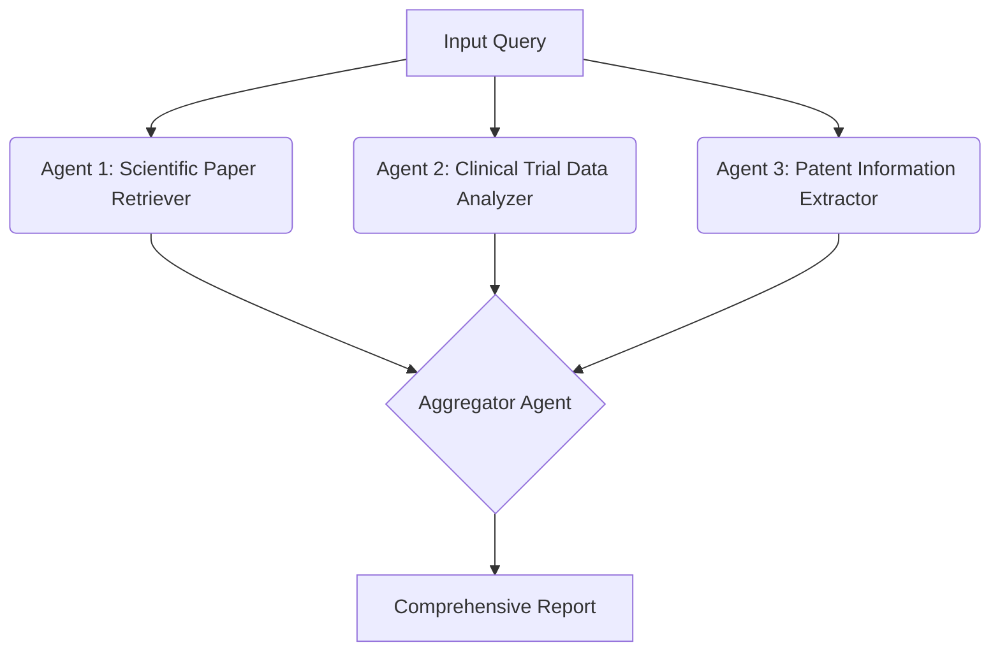

In the Aggregation pattern, multiple agents handle different sub-tasks and feed their results into a central aggregator agent that synthesizes the final output.
1. Input Query: The user or system provides a research query.
1. Parallel Sub-Tasks: Specialized agents fetch data from different sources (e.g., scientific papers, clinical trial data, and patents).
1. Aggregation: The Aggregator Agent synthesizes the data, generating a comprehensive report.
1. Output Generation: The final report is delivered to the user.

-----

