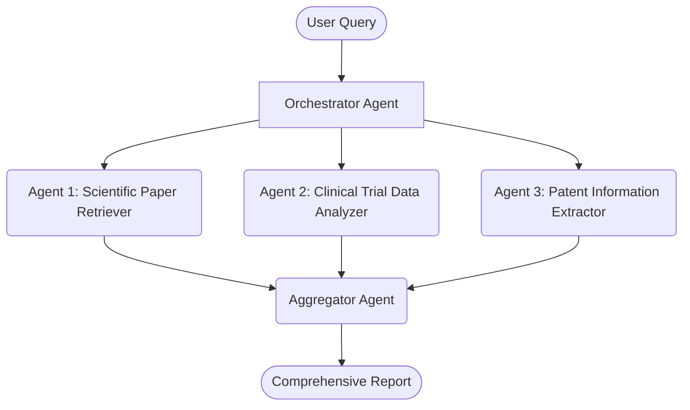

In the Aggregation pattern, multiple agents handle different sub-tasks and feed their results into a central aggregator agent that synthesizes the final output.
1. User Query: A query is submitted to the Orchestrator Agent.
1. Task Distribution: The Orchestrator Agent delegates sub-tasks to specialized agents for different data sources (e.g., scientific papers, clinical trial data, and patents).
1. Parallel Processing: Each specialized agent retrieves and processes data from its designated source.
1. Aggregation: The Aggregator Agent combines the results from all specialized agents.
1. Output Generation: A comprehensive report is produced incorporating all gathered information.

-----

