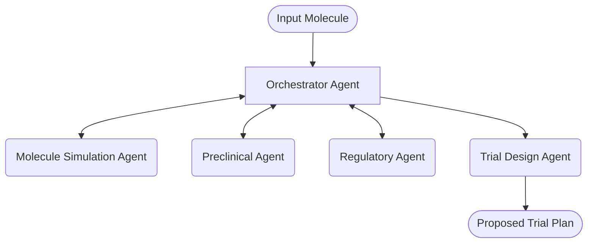

In the Delegation pattern, agents handle distinct phases of drug development, passing control from one phase to the next.
1. Input Molecule: The initial molecule candidate is provided to the Orchestrator Agent.
1. Molecule Simulation Agent: Performs computational analysis and simulations of the molecule.
1. Preclinical Agent: Analyzes in vitro and animal testing results.
1. Regulatory Agent: Ensures compliance with regulations and guidelines.
1. Trial Design Agent: Creates a comprehensive clinical trial plan.

-----

