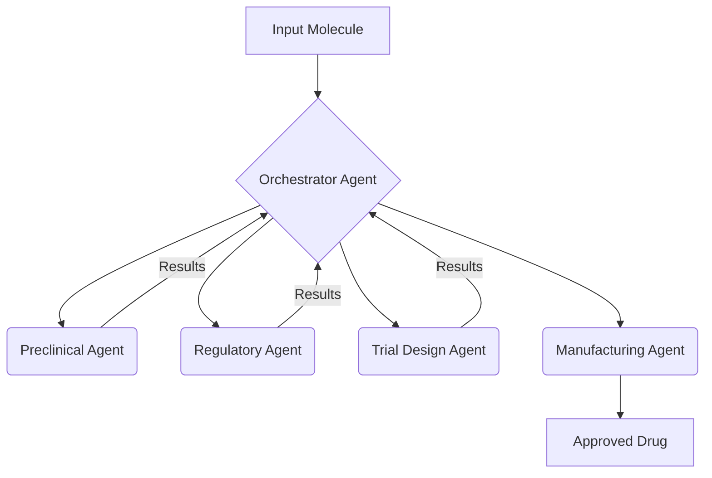

In the Delegation pattern, agents handle distinct phases of drug development, passing control from one phase to the next.
1. Input Molecule: The initial molecule candidate is provided.
1. Preclinical Agent: Analyzes in vitro and animal testing results.
1. Regulatory Agent: Ensures compliance with regulations.
1. Trial Design Agent: Designs and executes clinical trials.
1. Manufacturing Agent: Prepares for large-scale production.

-----

