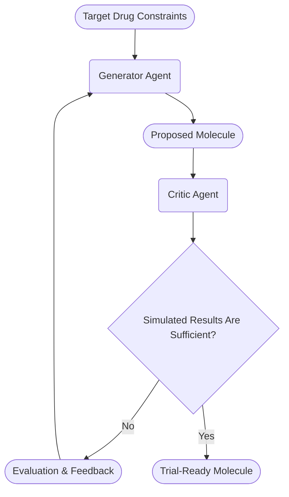

In the Generator-Critic Loop pattern, two agents iteratively refine a molecule design until it meets target drug constraints.
1. Target Constraints: Initial drug design requirements and constraints are provided.
1. Generator Agent: Creates or modifies a molecule structure based on target constraints and feedback.
1. Critic Agent: Evaluates the proposed molecule through simulation and analysis.
1. Evaluation Loop: If the molecule needs improvement, detailed feedback is provided to the Generator.
1. Final Output: When simulated results meet requirements, a trial-ready molecule is produced.

-----

