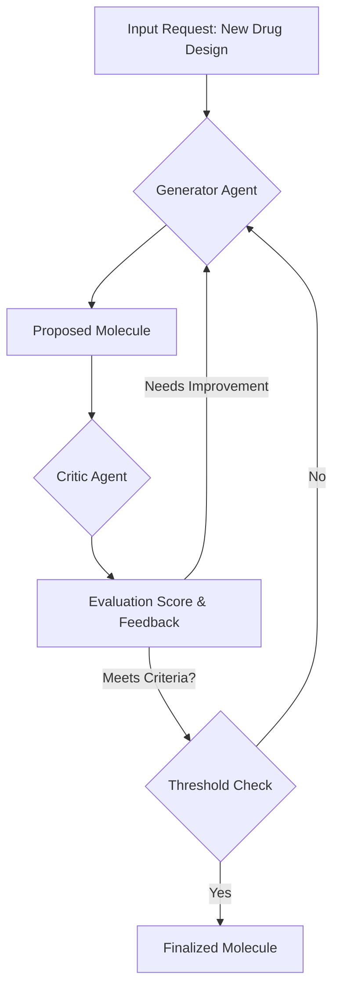

In the Generator-Critic Loop pattern, two agents iteratively refine an output until it meets a predefined threshold of quality.
1. Input Request: A molecular design problem is given.
1. Generator Agent: Proposes a new molecule structure.
1. Critic Agent: Evaluates the molecule based on properties like bioavailability, toxicity, and synthesis feasibility.
1. Feedback Loop: The Generator iterates and refines the molecule based on feedback.
1. Threshold Check: Once a molecule meets the criteria, it is finalized.

-----

