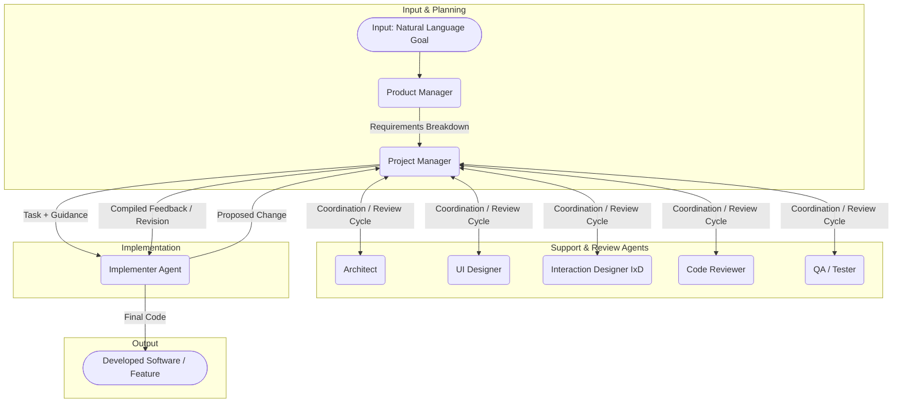

# Team-Collaboration Pattern

In the Team-Collaboration pattern, multiple agents embody specialized roles found in a typical software development team. A Project Manager coordinates tasks and communication between agents responsible for requirements, architecture, design, implementation, review, and testing, enabling collaborative development towards a common goal.

1.  **Project Requirements:** Input defining the software or feature to be built.
2.  **Product Manager:** Interprets requirements and defines actionable tasks.
3.  **Project Manager:** Manages workflow, assigns tasks, facilitates communication, and acts as the central hub for the development cycle.
4.  **Architect:** Defines high-level structure, technical standards, and provides guidance (coordinated via Project Manager).
5.  **UI/IxD Designers:** Create user interface specifications and interaction flows (coordinated via Project Manager).
6.  **Implementer Agent:** Writes the code based on the task and compiled guidance received from the Project Manager.
7.  **Code Reviewer:** Analyzes code for quality, standards adherence, and potential issues (reporting feedback to Project Manager).
8.  **QA / Tester:** Verifies the implemented feature against requirements and performs testing (reporting feedback to Project Manager).
9.  **Feedback Loops:** Iterative cycles where reviewers provide feedback *to the Project Manager*, who compiles it and delivers it to the Implementer for refinement.
10. **Developed Software:** The final code or feature produced by the swarm.

-----

