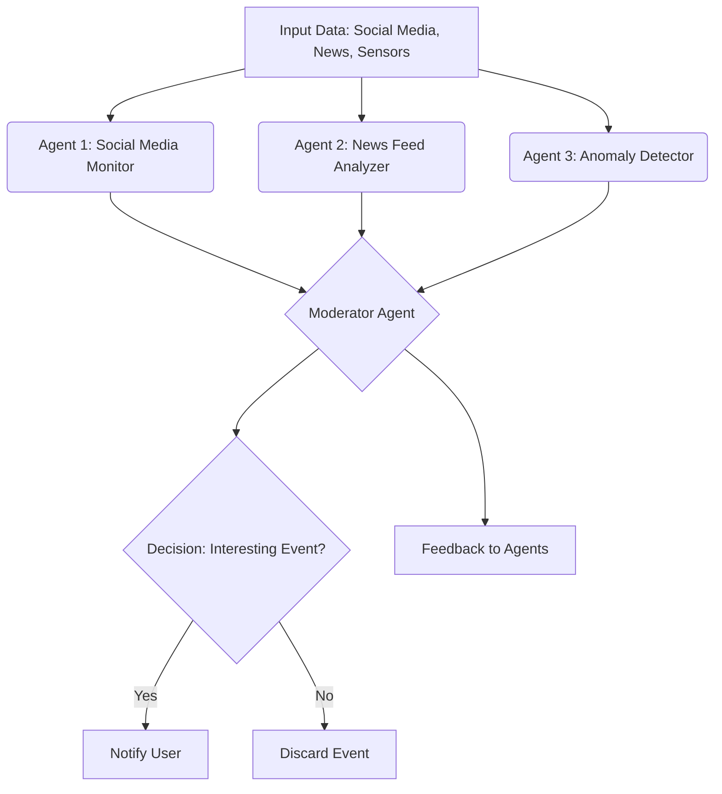

In the Voting/Moderator pattern, agents interact as follows:
1. Input Gathering: Multiple agents independently monitor different data sources (e.g., social media, news feeds, sensor data) to detect signals of potentially interesting world events.
1. Proposal Generation: Each agent generates a hypothesis or signal about an event's importance or uniqueness (e.g., unusual social sentiment spikes or geopolitical developments).
1. Voting Process: Agents submit their assessments to a Moderator Agent, which aggregates the scores or opinions.
1. Decision Threshold: The Moderator Agent applies a threshold or weighted voting mechanism to determine if the event is “interesting” enough to warrant notification.
1. Feedback Loop: The Moderator can provide feedback to individual agents to improve their detection models or adjust their sensitivity.

-----

