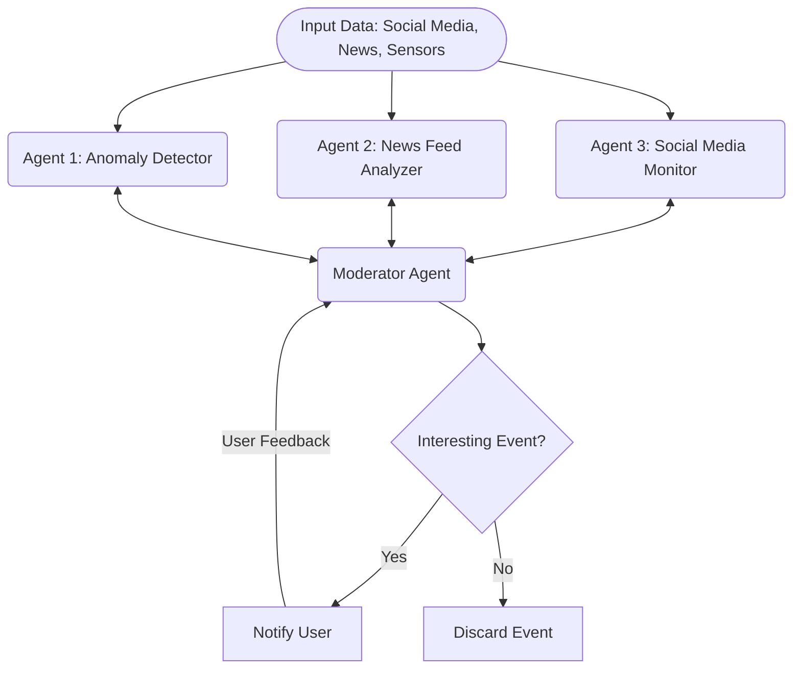

In the Voting/Moderator pattern, agents interact as follows:
1. Input Processing: Three specialized agents analyze different aspects of input data (social media, news feeds, and anomaly detection).
1. Proposal Generation: Each agent generates a hypothesis or signal about an event's importance or uniqueness (e.g., unusual social sentiment spikes or geopolitical developments).
1. Event Evaluation: The Moderator Agent processes inputs from all agents to determine if an interesting event has been detected.
1. Decision Making: Based on the collective input, events are either flagged for user notification or discarded.
1. User Feedback Loop: User responses to notifications help refine the Moderator Agent's decision-making process.
    * The Moderator can provide feedback to individual agents to improve their detection models or adjust their sensitivity.

-----

